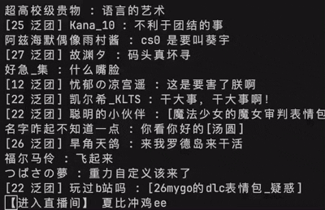

# 使用 `AsyncEvent`

`AsyncEvent` 是模块提供的一个基础类，主要实现了发布-订阅模式的异步事件类。其常作用于长过程的异步操作中，例如上传视频、连接直播间以及消息监听。在这些异步过程中，模块将通过 `AsyncEvent` 类的方法发布事件，例如收到弹幕后发布弹幕事件、上传视频汇报进度也可以发布事件。发布事件后，`AsyncEvent` 类将调用用户提供的回调函数，用户即可实现对事件的订阅。回调函数支持同步函数与异步函数，但建议使用异步函数作为回调函数，或是不阻塞的同步函数作为回调函数。

接下来将用模块中的两个典型 `AsyncEvent` 类作演示，分别是 `live.LiveDanmaku` 和 `session.Session`。

## 1. `live.LiveDanmaku`

众所周知，哔哩哔哩网页端通过 WebSocket 和直播服务器连接，`live.LiveDanmaku` 核心功能即调用模块的 WebSocket 连接功能，完成和直播间的交互。交互分发送消息和接收消息，此处发送的消息主要是心跳包，模块会自动发送心跳包，因此使用 `live.LiveDanmaku` 时，只需要关注 WebSocket 收到的消息即可。

收到消息后，模块会对消息进行解码，一般解码后会得到 JSON 格式的数据。约 2025 年 7 月时，直播间发送消息中出现 protobuf 格式数据，此时 `live.LiveDanmaku` 将自动把 protobuf 数据转换为 JSON 格式。总之，最后回调函数拿到的数据，一般是一个 JSON 反序列化后的字典对象，和通过 HTTP 调用 API 接口返回的数据不会有太大差别。

对 `LiveDanmaku` 类来说，回调函数仅需提供一个 `dict` 类型参数即可。为了绑定回调函数，可以使用 `add_event_listener` 方法，亦可使用 `on` 装饰器，如下：

``` python
@dm.on("DANMU_MSG")
async def handle_dm_msg(data: dict) -> None:
    pass
```

通过上述方式即可完成对事件回调的绑定，此操作应该在异步过程启动之前执行。绑定完回调后，即可启动异步过程，对 `live.LiveDanmaku` 来说，即开始连接直播间。

我们使用 `connect` 方法连接直播间，此方法会开始运行连接直播间的主程序，连接完直播间后仍需要持续接收信息，因此该方法是阻塞的，直到主程序结束后才会停止。直播间理论上可以无限地连接，因此主程序需要手动结束，不然程序永远无法退出，可以使用 `disconnect` 方法关闭对直播间的连接。

此处优先考虑终端环境下的演示，故使用 `Ctrl + C` 作为终止信号，只需要加入对 `KeyboardInterrupt` 的异常捕获即可优雅地用 `Ctrl + C` 结束程序。理论上取消直播间连接会在 `await dm.connect()` 处收到 `asyncio.CancelledError`，但模块所有的 `AsyncEvent` 类运行过程中均会主动捕获此异常，此处就不用再捕捉了。

``` python
dm = live.LiveDanmaku(room_display_id=33989, credential=credential)
# 建议加入凭据类连接直播间，否则……可以尝试退出登录后体验一下网页端直播页面
try:
    await dm.connect()
except KeyboardInterrupt:
    await dm.disconnect()
```

可以先尝试不绑定任何回调，运行以上代码，可以发现终端出现了部分日志信息，因为模块在 `live.LiveDanmaku` 中配置了日志，用于输出直播间连接过程中的信息，包括正在连接服务器、认证成功、正在关闭连接等。稍等片刻，不出意外的话，模块将成功连接上服务器，将会显示“认证成功”，此处可以按下 `Ctrl + C`，程序就能优雅地退出了。

```shell
python3 test-trio.py
[33989][2026-08-07 22:47:17,956][INFO] 准备连接直播间 33989
[33989][2026-08-07 22:47:19,121][INFO] 正在尝试连接主机： wss://zj-cn-live-comet.chat.bilibili.com:2245/sub
[33989][2026-08-07 22:47:19,239][INFO] 连接服务器并认证成功
^C%
```

在确认可以正常连接直播间后，即可正式绑定回调函数，开始获取信息（主要是弹幕）。这边假设我们对传入数据结构一无所知，于是在回调函数中，我们只打印传入的数据：

``` python
@dm.on("DANMU_MSG")
def dm_msg(data: dict) -> None:
    print(data)
```

`@dm.on` 的括号中是事件名称，`DANMU_MSG` 即对应了单条弹幕，这些字符串可以在 `live.LiveDanmaku` 的 docstring 中找到，或者，可以翻阅 `live.LiveDanmaku` 类的文档查看。

运行程序，就会发现输出了许多字典对象，此处节选一条弹幕的信息：

``` python
{
    "room_display_id": 33989,
    "room_real_id": 33989,
    "type": "DANMU_MSG",
    "data": {
        "cmd": "DANMU_MSG",
        "dm_v2": "",
        "info": [
            [
                0,
                1,
                25,
                16777215,
                1786114405665,
                1066685255,
                0,
                "f0650ae2",
                0,
                0,
                0,
                "",
                0,
                "{}",
                "{}",
                {
                    "extra": '{"send_from_me":false,"master_player_hidden":false,"mode":0,"color":16777215,"dm_type":0,"font_size":25,"player_mode":1,"show_player_type":0,"content":"大叔好贴这个人脸啊","user_hash":"4033153762","emoticon_unique":"","bulge_display":0,"recommend_score":7,"dm_score":0,"chronos_force_display":0,"main_state_dm_color":"","objective_state_dm_color":"","direction":0,"pk_direction":0,"quartet_direction":0,"anniversary_crowd":0,"yeah_space_type":"","yeah_space_url":"","jump_to_url":"","space_type":"","space_url":"","animation":{},"emots":null,"is_audited":false,"id_str":"30c072a5bdb3ce4239b006fcbd6a75f18805","icon":null,"show_reply":true,"reply_mid":0,"reply_uname":"","reply_uname_color":"","reply_is_mystery":false,"reply_type_enum":0,"hit_combo":0,"esports_jump_url":"","is_mirror":false,"is_collaboration_member":false,"card":{"card_type":0,"oid_str":"","oid_str_1":"","origin_oid_str":"","share_id":"","share_origin":"","from":"","card_content":null},"voice":null,"background_type":0}',
                    "mode": 0,
                    "show_player_type": 0,
                    "user": {
                        "anon": None,
                        "base": {
                            "face": "https://i0.hdslb.com/bfs/face/6d8a0e1bf1e19c3d63ac451875968dd72d48016c.jpg",
                            "is_mystery": False,
                            "name": "姬野家的星奏",
                            "name_color": 0,
                            "name_color_str": "",
                            "official_info": {
                                "desc": "",
                                "role": 0,
                                "title": "",
                                "type": -1,
                            },
                            "origin_info": {
                                "face": "https://i0.hdslb.com/bfs/face/6d8a0e1bf1e19c3d63ac451875968dd72d48016c.jpg",
                                "name": "姬野家的星奏",
                            },
                            "risk_ctrl_info": None,
                        },
                        "guard": None,
                        "guard_leader": None,
                        "medal": {
                            "color": 13081892,
                            "color_border": 13081892,
                            "color_end": 13081892,
                            "color_start": 13081892,
                            "guard_icon": "",
                            "guard_level": 0,
                            "honor_icon": "",
                            "id": 2226,
                            "is_light": 1,
                            "level": 18,
                            "name": "泛团",
                            "ruid": 63231,
                            "score": 1165,
                            "typ": 0,
                            "user_receive_count": 0,
                            "v2_medal_color_border": "#C770A499",
                            "v2_medal_color_end": "#C770A499",
                            "v2_medal_color_level": "#C770A4E6",
                            "v2_medal_color_start": "#C770A499",
                            "v2_medal_color_text": "#FFFFFF",
                        },
                        "title": {"old_title_css_id": "", "title_css_id": ""},
                        "uhead_frame": None,
                        "uid": 67268124,
                        "wealth": None,
                    },
                },
                {"activity_identity": "", "activity_source": 0, "not_show": 0},
                0,
            ],
            "大叔好贴这个人脸啊",
            [67268124, "姬野家的星奏", 0, 0, 0, 10000, 1, ""],
            [
                18,
                "泛团",
                "泛式",
                33989,
                13081892,
                "",
                0,
                13081892,
                13081892,
                13081892,
                0,
                1,
                63231,
            ],
            [13, 0, 6406234, ">50000", 0],
            ["", ""],
            0,
            0,
            None,
            {"ct": "41585B4A", "ts": 1786114405},
            0,
            0,
            None,
            None,
            0,
            260,
            [20],
            None,
        ],
    },
}
```

这坨数据显然也需要进一步处理，此处省略过程，最后可以通过以下键值，获取到单条弹幕的各种信息：

``` python
text = data["data"]["info"][1]  # 弹幕文字
user_info = data["data"]["info"][0][15]  # 发送者信息
user_name = user_info["user"]["base"]["name"]  # 发送者昵称，未登录状态下将变成三*堆
try:  # 以下粉丝牌字段可能存在
    medal_name = user_info["user"]["medal"]["name"]  # 粉丝牌
    medal_level = user_info["user"]["medal"]["level"]  # 粉丝牌等级
    print(f"[{medal_level} {medal_name}] {user_name} : {text}")
except Exception:
    print(f"{user_name} : {text}")  # 没有粉丝牌
```

其实前文代码中的 `try-catch` 可以省去，但程序仍然会正常运行，不会报错（~~可以试试~~），但异常仍然是会有的，只不过模块内部会捕获这个异常。这个异常最终也会抛出，但抛出的方式比较温柔，它们会通过 `__TASK_EXCEPTION__` 事件被发布出来。

``` python
@dm.on("__TASK_EXCEPTION__")
def raise_exception(e: Exception) -> None:
    raise e


# 用以上代码即可将所有错误全部抛出，然后程序可能就中断了
# 显然，在这个回调函数中再有错误抛出，模块就不会再发布 __TASK_EXCEPTION__ 了，而是直接抛出异常。
```

因此若有调试需求，例如此处在报错后，最后的 `print` 不会执行，就会有漏弹幕的情况，就可以考虑对 `__TASK_EXCEPTION__` 进行监听了。

应用上述代码，一个简易的终端弹幕姬就完成了，来看看实战效果：

``` plaintext
[17 泛团] 勃力银梦 : 不要给我看这个口牙！
[14 泛团] 即将精神错乱 : 😭
[14 泛团] 有翡我思存 : cpu
[16 泛团] 萧山_爱阿钳 : 反胃了
[18 泛团] yuyu不是玉玉 : 纯在pua
[28 泛团] 江停晚 : 不要不要
枫少原生 : 简称好事没你份 坏事你背锅
[20 泛团] 一笑冷 : 阿梅真是超级高手
SoucreFimp_YZ : 就在今天
[19 泛团] rakka想不到名字 : 怎么还背后说坏话！
[30 泛团] UESUGl : i熊tv
柴界的梦想 : 为什么要说这么坏心眼的话
[28 泛团] 帝蒂缔谛碲諦 : 这不是左撇子艾伦
[8 泛团] 片道の切符 : 大人的世界
[18 泛团] 晩稚濑 : 一直在被他人摘果子吗
[16 泛团] 萧山_爱阿钳 : 这里是成年直播间吗
[20 泛团] 雾隐余绪 : 不要不要
[15 泛团] 皇珈鬼武士 : 太成人了
```

看着有些单调，终端下弹幕一行行打印出来总有些既不弹又不幕还不姬的感觉。这边就勉为其难多实现一个功能吧，我们尝试复刻用户进入直播间的效果：只需要在监听到进入直播间消息后，在终端进行打印，随后不换行，将光标移到行首 (`\r`)，这样多个人进入直播间后，就会有种“进入直播间那一行在滚动”的感觉，就这么办。

我们再使用打印大法获取一个用户进入直播间消息的示例，这个消息对应的名称为 `INTERACT_WORD_V2`。

``` python
@dm.on("INTERACT_WORD_V2")
def enter(data: dict) -> None:
    print(data)
```

``` python
{
    "room_display_id": 33989,
    "room_real_id": 33989,
    "type": "INTERACT_WORD_V2",
    "data": {
        "cmd": "INTERACT_WORD_V2",
        "data": {
            "dmscore": 10,
            "pb": "CLq62owBEgzmpaDmnKhIb3RhcnUiAgMBKAEwxYkCOP7v19MGQJTT9+z9M0ooCP/tAxAWGgbms5vlm6Igy6hpKMuoaTCSu8oCOMuoaUABYMWJAmj3GmIAeMSQ9uX64+PkGJoBALIBygEIurrajAESWgoM5qWg5pyoSG90YXJ1EkpodHRwczovL2kxLmhkc2xiLmNvbS9iZnMvZmFjZS9lYjliZDBjYjVjMzVmOWM0YzNhYzkyMzNkNTljODMxZTBjMzAxYzc1LmpwZxpgCgbms5vlm6IQFhjLqGkgkrvKAijLqGkwy6hpOLIRSAFQ/+0DYPcaegkjM0ZCNEY2OTmCAQkjM0ZCNEY2OTmKAQkjM0ZCNEY2OTmSAQcjRkZGRkZGmgEJIzNGQjRGNkU2IgIIBTIAugEAwgEA",
        },
    },
}
```

可以说，前面弹幕获取到的数据结构乱，但至少许多字段都看得懂，而这边进入直播间获取到的数据……已经进化到字节数据了（这边服务端已对字节进行了 base64 加密），可谓是一点给人理解的可能性都没有。

其实这就是前文曾经提到过的 protobuf 数据。

> 约 2025 年 7 月时，直播间发送消息中出现 protobuf 格式数据，此时 `live.LiveDanmaku` 将自动把 protobuf 数据转换为 JSON 格式。

好吧，上面的数据其实并非模块传入的数据，模块传入的数据其实长下面这样：

``` python
{
    "room_display_id": 33989,
    "room_real_id": 33989,
    "type": "INTERACT_WORD_V2",
    "data": {
        "cmd": "INTERACT_WORD_V2",
        "data": {
            "dmscore": 10,
            "pb": "CLq62owBEgzmpaDmnKhIb3RhcnUiAgMBKAEwxYkCOP7v19MGQJTT9+z9M0ooCP/tAxAWGgbms5vlm6Igy6hpKMuoaTCSu8oCOMuoaUABYMWJAmj3GmIAeMSQ9uX64+PkGJoBALIBygEIurrajAESWgoM5qWg5pyoSG90YXJ1EkpodHRwczovL2kxLmhkc2xiLmNvbS9iZnMvZmFjZS9lYjliZDBjYjVjMzVmOWM0YzNhYzkyMzNkNTljODMxZTBjMzAxYzc1LmpwZxpgCgbms5vlm6IQFhjLqGkgkrvKAijLqGkwy6hpOLIRSAFQ/+0DYPcaegkjM0ZCNEY2OTmCAQkjM0ZCNEY2OTmKAQkjM0ZCNEY2OTmSAQcjRkZGRkZGmgEJIzNGQjRGNkU2IgIIBTIAugEAwgEA",
            "pb_decoded": {
                "uid": 295083322,
                "uname": "楠木Hotaru",
                "identities": [2],
                "msg_type": 1,
                "room_id": 33989,
                "timestamp": 1786116094,
                "score": 1786129541524,
                "fans_medal_info": {
                    "target_id": 63231,
                    "medal_level": 22,
                    "medal_name": "泛团",
                    "medal_color": 1725515,
                    "medal_color_start": 1725515,
                    "medal_color_end": 5414290,
                    "medal_color_border": 1725515,
                    "is_lighted": 1,
                    "anchor_roomid": 33989,
                    "score": 3447,
                },
                "contribution_info": {},
                "trigger_time": 1786116093433972804,
                "contribution_info_v2": {},
                "user_info": {
                    "uid": 295083322,
                    "base": {
                        "name": "楠木Hotaru",
                        "face": "https://i1.hdslb.com/bfs/face/eb9bd0cb5c35f9c4c3ac9233d59c831e0c301c75.jpg",
                    },
                    "medal": {
                        "name": "泛团",
                        "level": 22,
                        "color_start": 1725515,
                        "color_end": 5414290,
                        "color_border": 1725515,
                        "color": 1725515,
                        "id": 2226,
                        "is_light": 1,
                        "ruid": 63231,
                        "score": 3447,
                        "v2_medal_color_start": "#3FB4F699",
                        "v2_medal_color_end": "#3FB4F699",
                        "v2_medal_color_border": "#3FB4F699",
                        "v2_medal_color_text": "#FFFFFF",
                        "v2_medal_color_level": "#3FB4F6E6",
                    },
                    "wealth": {"level": 5},
                    "guard": {},
                },
                "user_anchor_relation": {},
            },
            "pb_decode_message": "success",
        },
    },
}
```

可以看到已经把 protobuf 数据解密了，变成正常的 JSON 格式了。接下来的处理也就简单了：

``` python
user_info = data["data"]["data"]["pb_decoded"]
user_name = user_info["uname"]
print(f"【进入直播间】 {user_name}", end="\r")  # 此处只显示用户名确实是为了偷懒
```

最后给到源代码和生草的效果图：

``` python
from bilibili_api import Credential, live, sync

credential = Credential(...)


async def main():
    dm = live.LiveDanmaku(room_display_id=33989, credential=credential)

    @dm.on("DANMU_MSG")
    def dm_msg(data: dict) -> None:
        text = data["data"]["info"][1]
        user_info = data["data"]["info"][0][15]
        user_name = user_info["user"]["base"]["name"]
        try:
            medal_name = user_info["user"]["medal"]["name"]
            medal_level = user_info["user"]["medal"]["level"]
            print(f"[{medal_level} {medal_name}] {user_name} : {text}")
        except Exception:
            print(f"{user_name} : {text}")

    @dm.on("INTERACT_WORD_V2")
    def enter(data: dict) -> None:
        user_info = data["data"]["data"]["pb_decoded"]
        user_name = user_info["uname"]
        print(f"【进入直播间】 {user_name}", end="\r")

    try:
        await dm.connect()
    except KeyboardInterrupt:
        await dm.disconnect()


sync(main())
```



上面的代码只有两个事件需要监听，也只需要两个函数。但事件一旦多了起来，就需要编写多个函数分别处理事件，有的时候会很麻烦。

因此，模块提供一个奇妙事件 `__ALL__`，它将在除 `__ALL__` 和 `__TASK_EXCEPTION__` 外的其他所有事件发布时，额外发布出来。

``` python
@dm.on("__ALL__")
def on_all(info: dict) -> None:
    event_name = info["name"]
    data = info["data"]
    print(event_name, data)
```

绑定此函数回调后再连接直播间，就能感受到被信息包围的氛围感了。

## 2. `session.Session`

接下来要介绍的是 `session.Session`，用于监听私聊消息的 `AsyncEvent` 类。相较于 `live.LiveDanmaku` 这样核心是 WebSocket 的异步过程来说，这个类的异步过程稍显另类，本质上是一个定时任务，每隔 6 秒钟刷新私聊区信息，拉取新消息。不仅如此，`session.Session` 同时支持消息回复功能，这就允许我们如此部署一个简易的聊天机器人。

事实上，直播间场景下亦可以使用 `live.LiveRoom` 中的函数发送弹幕，即回复弹幕，不过很明显这没有私聊的接发消息来得纯粹。不同于直播间，私聊功能支持多种类型消息，这边我们就只考虑两种基本类型，文字和图片。

前文已提到，私聊中会出现多种类型信息，不但如此，除了信息正文内容外，仍有其他信息的信息，例如发送者、发送时间等等，因此模块使用了 `session.Event` 包装了抓取到的信息。这个类属性很多，此处我们只需要最重要的 `content` 属性，即事件内容。至于事件内容类型的判断，可以使用 `msg_type` 属性，也可以按照下面的方法直接绑定在回调中：

``` python
@session.on(EventType.TEXT)  # 当收到文字信息时触发
async def reply(event: Event):
    pass


@session.on(EventType.PICTURE)  # 当收到图片时触发
async def filter_pic(event: Event):
    pass
```

现在问题来了，`event.content` 当收到文字时为 `str`，毋庸置疑，那收到图片的时候，`event.content` 又是什么呢？答案是模块提供的 `Picture` 类 (`bilibili_api.Picture`)。

`Picture` 类本质上是对 `PIL.Image.Image` 的异步封装（此处假设读者对 `Python Imaging Library` a.k.a. `pillow` 有基本了解），接下来将分别介绍如何初始化一个 `Picture` 类、如何将 `Picture` 类转换为图片内容、文件乃至链接，以及如何对 `Picture` 类包装的 `PIL.Image.Image` 对象进行操作。

初始化 `PIL.Image.Image` 只需要提供一个字节流即可，`Image.open` 不会一次性读取全部内容，模块为此提供 `Picture.from_file` 和 `Picture.from_content` 两个同步函数，可以直接在异步函数中使用。如果需要加载网络图片，使用异步方法 `Picture.load_url`，因为此方法内部已经涉及到网络请求。

`Picture` 对象存在以下属性：`url` 为网络链接或本地文件地址，如果图片为从字节中加载或已经更改过，`url` 属性将设置为 `<bytes>.{extension}`，其中 `extension` 为图片后缀名，也是 `Picture` 对象中存在的属性。此外还有 `width` `height` 属性，表示图片宽度和高度。

初始化 `Picture` 对象后，可以通过异步函数 `Picture.content` 获取图片字节内容，异步函数 `Picture.download` 将图片保存到本地文件，亦可以使用哔哩哔哩动态相关功能，将其上传至服务器，只需要调用 `Picture.upload(credential=Credential(...))` 即可，此时获取 `Picture` 类的 `url` 属性，即可获得上传成功后的链接。

`Picture` 类提供 `Picture.image_call` 对 `PIL.Image.Image` 对象进行操作。例如 `Image.resize((width, height))` 可以调整图片大小，并返回一个新的 `Image` 对象，这个过程可能是阻塞的，因此模块会在一个工作进程中执行此函数，以免阻塞事件循环，在函数执行完成后，`Picture` 类会将其包装的图片设置为返回结果。这就是 `Picture.image_call` 函数在做的事，此处调用 `await Picture.image_call("resize", (width, height))` 即可调整 `Picture` 类对应图片的大小了。

接下来就可以开始编写逻辑了。对文字消息来说，我们只特殊识别两个文本：收到 `/close` 的时候结束轮询，和收到 `/pic` 的时候发送一张图片，其余情况统一回复 `你好`。

说到结束轮询，就不得不提开始轮询了，`session.Session` 类使用 `start` 函数开始异步过程，使用 `close` 函数结束异步过程，注意前者为异步函数，后者为同步函数。收到 `/close` 后，只需要调用 `close` 函数即可。

回复消息可以使用 `session.reply`，其接受两个参数，第一个是需要回复的消息，即回调函数的参数 `event`，第二个是具体内容，如果是文本就直接传入文本，如果是图片就需要使用 `Picture` 类了。先使用 `Picture.from_file("path/to/pic")` 加载本地图片，然后使用异步函数 `upload` 将其上传，随后就可以发送了。

> 如果传入的 `Picture` 类尚未上传，模块大多数情况下将自动上传图片。

于是我们可以完善前文收到消息的回调函数如下：

``` python
@session.on(EventType.TEXT)
async def reply(event: Event):
    if event.content == "/close":
        session.close()
    elif event.content == "/pic":
        img = await Picture.from_file("test.jpg").upload(session.credential)
        await session.reply(event, img)
    else:
        await session.reply(event, "你好")
```

如果收到的是图片，这里实现两个逻辑，首先把图片下载到本地，即调用 `download` 函数，然后给图片加一层滤镜，再发回去，加滤镜可以使用 `Image.Filter` 函数，或是 `Picture.image_call("filter", ...)`，回复图片仍然使用 `reply` 方法。最后回调函数如下：

``` python
@session.on(EventType.PICTURE)
async def save_pic(event: Event):
    await event.content.download(event.content.url.split("/")[-1])  # type: ignore
    # 截取 url 最后一节作文件名，保存在当前目录
    await event.content.image_call("filter", ImageFilter.SMOOTH)  # type: ignore
    # 此处用的滤镜时平滑滤波
    await session.reply(event, event.content)  # type: ignore
```

主程序部分，采用和前文连接直播间相同的写法，当 `Ctrl + C` 时停止轮询。

``` python
try:
    await session.start()
except KeyboardInterrupt:
    session.close()
```

运行即可。完整代码如下：

``` python
from PIL import ImageFilter
from bilibili_api import (
    Credential,
    Picture,
    select_client,
    sync,
)
from bilibili_api.session import Event, EventType, Session

select_client("httpx")
# 调用 select_client 即可指定网络请求库
# 此处使用了 httpx 作为网络请求库，以保证稳定性

credential = Credential(...)

session = Session(credential, debug=True)


@session.on(EventType.TEXT)
async def reply(event: Event):
    if event.content == "/close":
        session.close()
    elif event.content == "/pic":
        img = await Picture.from_file("test.jpg").upload(session.credential)
        await session.reply(event, img)
    else:
        await session.reply(event, "你好")


@session.on(EventType.PICTURE)
async def save_pic(event: Event):
    await event.content.download(event.content.url.split("/")[-1])  # type: ignore
    await event.content.image_call("filter", ImageFilter.SMOOTH)  # type: ignore
    await session.reply(event, event.content)  # type: ignore


async def main():
    try:
        await session.start()
    except KeyboardInterrupt:
        session.close()


sync(main())
```
